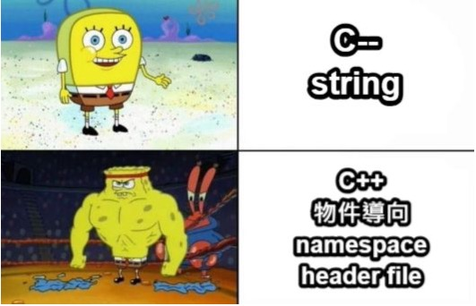

# NCKU Compiler 2024 Spring Assignments

A complete C-- compiler front-end & backend
Lex → Parse → Codegen → JVM
> C-- = C++ without OOP lol

## Overview

This repository contains my implementation for the 2024 Spring NCKU Compiler course, including:

- HW1 – Lexical Analysis (Scanner)
- HW2 – Syntax Analysis (Parser + Symbol Table)
- HW3 – Code Generation (Java ASM → JVM bytecode)

The final result is a working compiler that translates a simplified C++-like language (C--) into Java bytecode (.class) and executes it on the JVM.

## HW1 – Lexer

- Identifiers, keywords, literals
- Operators + - * / == != <= >= …
- Line & block comments
- Regex-based tokenization

## HW2 – Parser

> Implementing a full *hash table* or *linked list* felt overkill,
so the Symbol Table is built with a simple **2-D dynamic array**. It worked, at least.

- LALR(1) grammar using Yacc/Bison
- Grammar for expressions, statements, functions
- Operator precedence & associativity
- Scopes & symbol tables
- Insert/dump variable info
- Supports: if/else, while, for, arrays, functions, auto

## HW3 – Code Generation

- Translate AST to Java Assembly (Jasmin)
- Local variables, arithmetic, control-flow labels
- Function call & return
- Assemble to .class and run on JVM

## Supported Language Features

- Data Types
  - int, float, auto
- Expressions
  - arithmetic
  - unary
  - type casting
  - precedence-respected evaluation
- Variables
  - global / local
  - scoping
  - arrays (1D / 2D)
- Control Flow
  - if
  - if...else
  - while
  - for
  - nested blocks
- Functions
  - parameters
  - returns
  - scope handling

## 🚧 TODO
- [ ] Finish full AST → Java ASM translation
(currently implemented up to subtask06 – if)

## 🔖 Note
The .zip file contains sample answer code — huge shout-out to the TAs 🙏 Orz